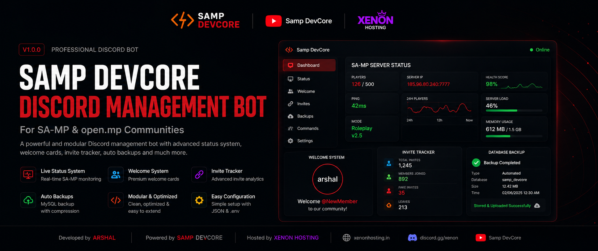
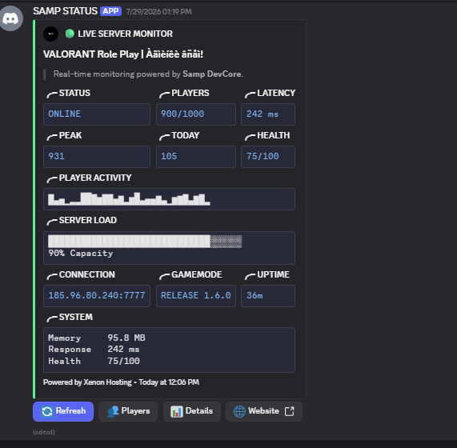
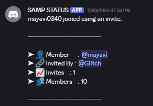
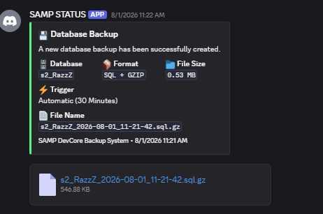
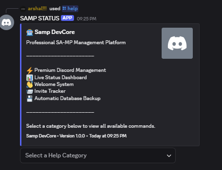

<p align="center">
  
</p>

<p align="center">
  
  
  
  
  
</p>

---

# Samp DevCore — Discord Management Bot

Professional Discord management for SA‑MP / open.mp communities. A modular Node.js bot (discord.js v14) providing live server status, welcome cards, invite tracking, and automated backups.

---

## Table of contents

- [About](#about)
- [Showcase](#showcase)
- [Features](#features)
- [Requirements](#requirements)
- [Installation](#installation)
- [Configuration](#configuration)
- [Folder Structure](#folder-structure)
- [Commands](#commands)
- [Backup System](#backup-system)
- [Architecture](#architecture)
- [Performance](#performance)
- [Security](#security)
- [Roadmap](#roadmap)
- [FAQ](#faq)
- [Troubleshooting](#troubleshooting)
- [Contributing](#contributing)
- [Official Hosting](#official-hosting)
- [Credits](#credits)
- [License](#license)
- [Copyright](#copyright)
- [Support](#support)

---

## Banner

<p align="center">
  
</p>

---

## About

Samp DevCore is a Discord management bot built for SA‑MP and open.mp communities. It provides tools to monitor game servers, welcome new members with canvas images, track invite sources, and perform automated MySQL backups. The project focuses on clarity, modularity, and maintainability.

- Developer: **Arshal**
- Organization: **Samp DevCore**
- Runtime: **Node.js**
- Framework: **discord.js v14**
- Database: **MySQL**

---

## Showcase

### Status System

<p align="center">
  
</p>

### Welcome System

<p align="center">
  
</p>

### Invite Tracker

<p align="center">
  
</p>

### Backup System

<p align="center">
  
</p>

### Help Menu

<p align="center">
  
</p>

---

## Features

| Feature | Description | Benefit |
|---|---|---|
| Live Status System | Queries SA‑MP server for player count, response time, and basic metrics | Shows server availability inside Discord |
| Premium Dashboard | Consolidated status and health score | Professional view for staff and players |
| Auto Updating Status | Background service updates a pinned/status message | Low maintenance updates |
| Welcome System | Canvas-based welcome cards with avatar and background | Improved onboarding and branding |
| Invite Tracking | Local invite cache with rejoin/fake detection | Accurate invite attribution for moderation/rewards |
| Backup Automation | MySQL dump → gz compression → Discord upload | Simple offsite backups and retention management |
| Interactive Help | `/help` with category select menu | Easier command discovery for users |
| Modular Architecture | Clear separation: commands, handlers, services, managers | Easier to maintain and extend |

---

## Requirements

- Node.js >= 18
- A Discord application (bot) with a token and required gateway intents
- MySQL 5.7+ (or compatible) for persistent storage
- Optional: VPS or hosting capable of running Node.js and MySQL client utilities

Required Discord intents: `Guilds`, `GuildMembers`, `GuildInvites`.

---

## Installation

Follow these steps to install and run the bot. All examples use safe placeholders—do not paste real secrets into public files.

1. Clone the repository

```bash
git clone https://github.com/arshal-exe/SampBot.git
cd SampBot
```

2. Install dependencies

```bash
npm install
```

3. Create `.env`

If a `.env.example` exists, copy it:

```bash
cp .env.example .env
```

If not, create `.env` at the project root and add the following (placeholders only):

```
TOKEN=your_discord_bot_token
CLIENT_ID=your_bot_application_id
GUILD_ID=your_test_guild_id
MYSQL_HOST=your_mysql_host
MYSQL_DATABASE=your_database_name
MYSQL_USER=your_database_user
MYSQL_PASSWORD=your_database_password
MYSQL_PORT=3306
WEBSITE=https://your-website.example
```

> Never commit `.env` to source control.

4. Configure `src/config/config.js`

Open `src/config/config.js` and ensure runtime defaults and server values are set. Use safe placeholder values in public documentation.

Example snippet for public docs:

```js
export default {
  token: process.env.TOKEN,
  clientId: process.env.CLIENT_ID,
  guildId: process.env.GUILD_ID,

  bot: {
    name: "Samp DevCore",
    version: "1.0.0",
    ownerId: "YOUR_DISCORD_USER_ID",
    developers: [
      { id: "YOUR_DISCORD_USER_ID", name: "Your Name", role: "Lead Developer" }
    ]
  },

  server: {
    name: "Your SA-MP Server",
    ip: "127.0.0.1",
    port: 7777
  },

  website: process.env.WEBSITE || "https://your-website.example",

  mysql: {
    host: process.env.MYSQL_HOST,
    database: process.env.MYSQL_DATABASE,
    user: process.env.MYSQL_USER,
    password: process.env.MYSQL_PASSWORD,
    port: Number(process.env.MYSQL_PORT || 3306)
  }
};
```

5. Prepare MySQL (example)

```sql
CREATE DATABASE sampbot;
CREATE USER 'samp_user'@'%' IDENTIFIED BY 'strong_password';
GRANT ALL PRIVILEGES ON sampbot.* TO 'samp_user'@'%';
FLUSH PRIVILEGES;
```

6. Start the bot

Production:

```bash
npm start
```

Development (auto-reload):

```bash
npm run dev
```

7. Verify that slash commands are deployed and the bot logs in successfully.

---

## Configuration

### `.env` and `.env.example`

- `.env` stores secrets (Discord token, MySQL credentials). Treat it as private.
- Copy `.env.example` → `.env` and fill values per environment.
- Do not commit `.env` to source control.

### `src/config/config.js`

- Holds bot metadata and runtime defaults.
- Use environment variables for sensitive data.
- Configure default SA‑MP server values (name, ip, port) used by the status system.

### JSON data files (`src/data/`)

Purpose:
- Provide local, human-readable persistence for caches and lightweight state.

Common locations:
- `src/data/status/` — status history, active message state
- `src/data/invites/` — invite cache, users, members
- `src/data/welcome/` — welcome config and background assets
- `src/data/backup/` — backup metadata and history

Notes:
- Authoritative, long-term data should be stored in MySQL where implemented.
- JSON files are used for caching and quick recovery after restarts.

---

## Folder Structure

```
src/
 ├── activity/              # Activity and presence control
 ├── assets/                # Fonts and screenshot assets
 ├── backup/                # Backup command modules (setup, now, disable)
 ├── commands/              # Slash command definitions (admin, public)
 ├── components/            # Reusable UI components and buttons
 ├── config/                # `config.js` and environment loader
 ├── core/                  # Bootstrap and startup wiring
 ├── data/                  # JSON state, caches, and assets
 ├── database/              # MySQL connection and utilities
 ├── embeds/                # Embed builders and formatting
 ├── events/                # Discord event handlers (client, guild)
 ├── handlers/              # Command & event loaders, deployer
 ├── help/                  # Help embed builder and categories
 ├── interactions/          # Select/menu and button handlers
 ├── invite/                # Invite processing workflows
 ├── managers/              # Managers controlling features lifecycle
 ├── services/              # Background services (backup, samp query, welcome)
 ├── statistics/            # Stats manager and persistence
 ├── status/                # Live status commands and helpers
 ├── temp/                  # Temporary files (backup dumps)
 ├── utils/                 # Helpers, formatting, permissions
 └── welcome/               # Welcome setup and preview utilities
```

---

## Commands

All commands listed reflect the current implementation.

### Status
| Command | Description |
|---|---|
| `/status setup` | Initialize live SA‑MP status reporting (admin only) |
| `/status refresh` | Refresh status card and cached server data (admin only) |
| `/status disable` | Disable live status updates and remove active status card (admin only) |

### Welcome
| Command | Description |
|---|---|
| `/welcome setup` | Configure welcome message channel and behavior (admin only) |
| `/welcome disable` | Disable welcome card delivery (admin only) |

### Invite
| Command | Description |
|---|---|
| `/invite setup` | Enable invite tracking and set log channel (admin only) |
| `/invite disable` | Disable invite tracking (admin only) |
| `/invite check` | Show invite counts for a user |
| `/invite reset` | Reset a user's invite counts (admin only) |

### Backup
| Command | Description |
|---|---|
| `/backup setup` | Start automatic scheduled backups and set target channel (admin only) |
| `/backup now` | Create an immediate MySQL dump, compress and upload to Discord (admin only) |
| `/backup disable` | Stop scheduled backups (admin only) |

### Help
| Command | Description |
|---|---|
| `/help` | Open the interactive help menu (category select menu) |

> Permission: Many commands are restricted; see `src/utils/permissions/requireAdmin.js` for logic.

---

## Backup System

The backup workflow implemented by the project:

1. Create a MySQL dump of the configured database (temporary SQL file in `src/temp/`).
2. Compress the SQL dump using GZip (`.sql.gz`).
3. Upload the compressed backup to the configured Discord channel.
4. Remove temporary files after the upload (cleanup).

Supported operations:
- Manual: `/backup now` — run immediately and upload result.
- Scheduled: `/backup setup` — enable automatic backups and channel.
- Disable: `/backup disable` — stop the scheduled backups.

Files of interest:
- `src/services/backup/createBackup.js`
- `src/services/backup/compressBackup.js`
- `src/services/backup/sendBackup.js`
- `src/services/backup/cleanupBackups.js`
- `src/backup/setup.js`, `src/backup/now.js`, `src/backup/disable.js`

Operational notes:
- Ensure the bot has permission to upload files in the backup channel.
- Monitor disk space on the host where temporary dumps are created.

---

## Architecture

A modular design keeps the codebase maintainable and predictable.

- **Handlers**: load commands and events dynamically and deploy slash commands.
- **Managers**: centralized lifecycle control for status, invites, welcome, backups.
- **Services**: perform specialized tasks (SA‑MP queries, canvas rendering, backups).
- **Commands**: slash command definitions organized by folder (`admin`, `public`).

Startup flow (simplified): connect database → init managers → load commands & events → deploy commands → login → start background services.

---

## Performance

- Batched statistics saves reduce disk I/O and avoid frequent writes.
- Status updates are throttled and applied only on meaningful changes.
- Invite data uses an in-memory cache with JSON persistence to reduce DB load.
- Backups are compressed before upload to minimize transfer size.

Operational advice: host on a stable VPS with sufficient CPU/RAM for canvas rendering and gzip compression.

---

## Security

- Keep secrets in `.env`. Never commit secrets to the repository.
- Use a dedicated MySQL user with limited privileges.
- Rotate tokens and database credentials if exposure is suspected.
- Verify `.gitignore` includes `.env` and `node_modules/`.

Recommended `.gitignore` snippet:

```gitignore
.env
node_modules/
*.log
```

---

## Roadmap

Planned / aspirational items (community contributions welcome):
- Web dashboard / admin panel
- Analytics & exportable reports
- Localization support
- Plugin system for community extensions
- API endpoints for external dashboards

---

## FAQ

Q: Can I run the bot for multiple guilds?  
A: The repository registers commands to the configured `GUILD_ID` by default; adapt `commandDeploy` for multi‑guild/global registration.

Q: How do I change the welcome background?  
A: Replace `src/data/welcome/background.png` with your image and test the preview command.

Q: Where is invite data stored?  
A: Invite cache and related metadata are stored in `src/data/invites/` JSON files; MySQL may also be used for additional persistence depending on configuration.

---

## Troubleshooting

- Bot fails to start: confirm Node.js version, `.env` variables, and run `npm install`.
- Slash commands not visible: ensure `CLIENT_ID` and `GUILD_ID` are correct and restart the bot.
- Backup failures: verify MySQL access, disk space, and upload permissions for the backup channel.
- Status not updating: check SA‑MP `ip` and `port` in `src/config/config.js` and network accessibility.

---

## Contributing

Contributions are welcome. Please:
1. Fork the repository.
2. Create a feature branch.
3. Keep changes focused and documented.
4. Open a pull request with clear testing notes.

Coding style: follow existing patterns, keep behavior predictable, and update docs for any user-visible changes.

---

## Official Hosting


**Developed, tested, and maintained on the official Xenon Hosting infrastructure.**

Xenon Hosting is the official hosting and infrastructure service used to operate this project. The infrastructure used by the project includes:

- VPS Hosting
- Discord Bot Hosting
- Node.js Hosting
- SA‑MP Hosting
- MySQL Hosting

Official resources:
- https://xenonhosting.example
- https://discord.gg/xenon-hosting

---

## Credits

| Role | Details |
|------|---------|
| Lead Developer | **Arshal** |
| Project | **Samp DevCore Discord Management Bot** |
| Organization | **Samp DevCore** |
| Official Hosting Service | **Xenon Hosting** |
| Runtime | **Node.js** |
| Framework | **discord.js v14** |
| Database | **MySQL** |

---

## License

This project is licensed under the MIT License. See the `LICENSE` file for full terms.

---

## Copyright

Copyright © 2026 Arshal.

Samp DevCore and Xenon Hosting are projects and services created and maintained by Arshal.

---

## Support

For support, updates, and discussion, join the Samp DevCore Discord Community.

---

Made with ❤️ by **Arshal**

Samp DevCore — Discord Management for SA‑MP / open.mp communities

Official Hosting Service: **Xenon Hosting**
